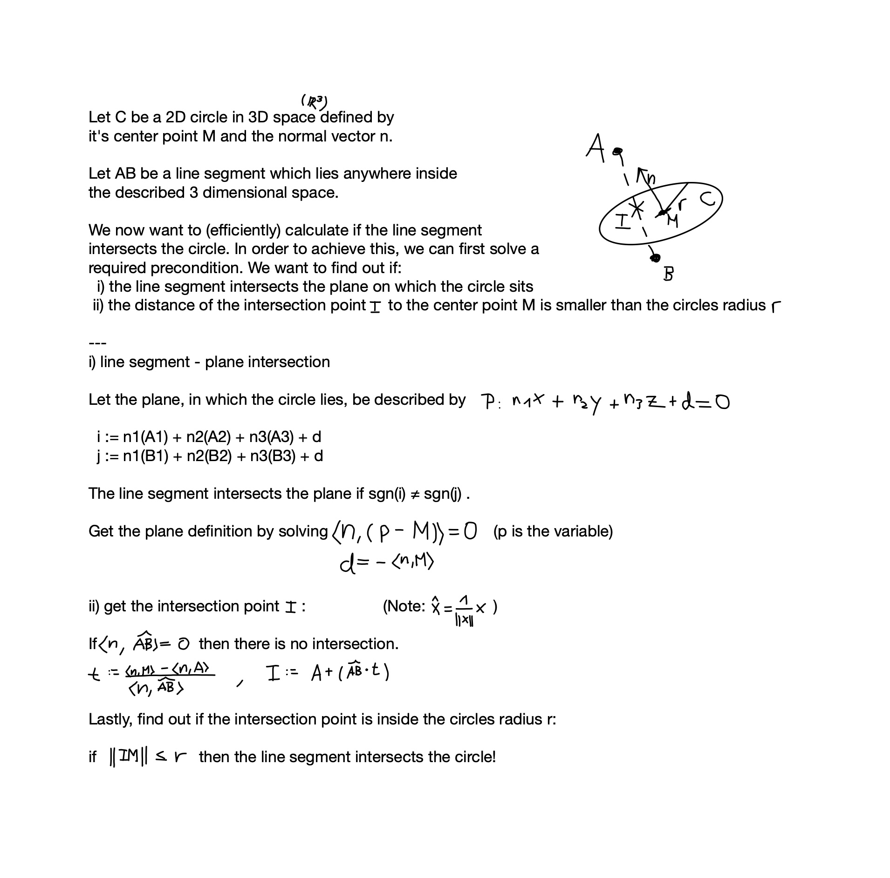

# Pixel Gliders Remastered (wip)

The (unpopular) rewinside.tv minigame remade with
[Minestom](https://github.com/Minestom/Minestom)

## Build and Run

1. Install Java 17 or newer and Maven 3.6 or newer
2. Run `dev.foxat.mc.pgr.Server`

## Contributing

yes, please

## On the topic of calculating when the elytra flight intersects a ring inside the minecraft world

